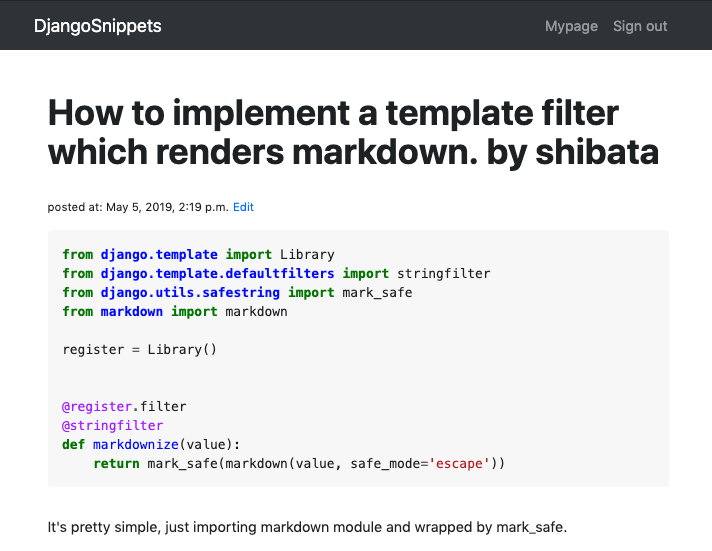

django-pygments-renderer
========================

Provides functionality for syntax highlighting using `Pygments <http://pygments.org/>`_ .

Installation
------------

django-pygments-renderer requires python 3.6 or later and Django 2.0 or later.

.. code-block:: console

   $ python3 -m pip install django-pygments-renderer

https://pypi.org/project/django-pygments-renderer/

Usage
-----

.. code-block:: python

   INSTALLED_APPS += [
       'pygments_renderer',
   ]

.. code-block:: html

   
   
   <html>
   <head>
       <title>{{ snippet.title}} - djangosnippets</title>
       
       <!-- other header tags -->
   </head>

   <body>
      

          <h2 class="title">{{ snippet.title }} by {{ snippet.created_by.username }}</h2>

          

              {{ snippet.code|pygmentize:"python3" }}
          

          

              {{ snippet.description }}
          

      

   </body>
   </html>

Similar projects
----------------

* https://github.com/richardcornish/django-pygmentify
* https://github.com/odeoncg/django-pygments
* https://github.com/sniku/django-pygments

Development
-----------

* lint: ``tox -e flake8`` or ``flake8``
* test: ``tox -e py37`` or ``DJANGO_SETTINGS_MODULE=test_settings python -m django test``

License
-------

This software is licensed under the MIT License (See `LICENSE <./LICENSE>`_ ).
